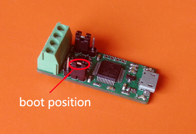
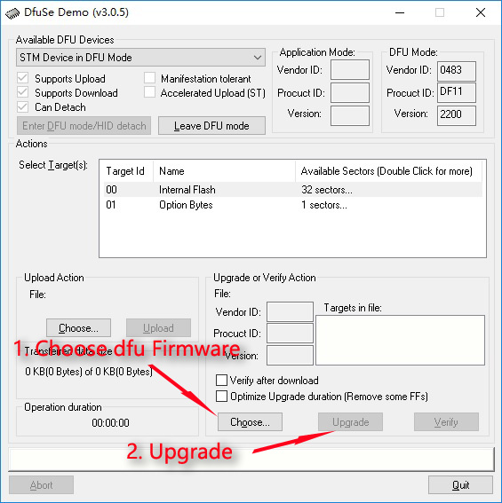
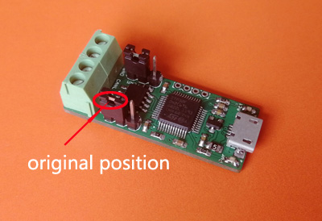

# Flashing new firmware #

## 1.candlelight-firmware   

[gsusb_canable.dfu](/Firmware/gsusb_canable.dfu)

## 2.slcan-firmware   

[canable-4f71d65.dfu](/Firmware/canable-4f71d65.dfu)

Reprogramming is fairly easy. First, move the "boot" jumper into the boot position as labelled on the PCB and then plug it into your computer.

If you are running Windows, download dfuse tool and follow ST's guide for installing the driver for the DFU device, generating a DFU file, and flashing the device.

If you're on Linux or Mac, install dfu-util from your distro's package manager or from brew on OSX. Run the following command to flash your device:

sudo dfu-util -d 0483:df11 -c 1 -i 0 -a 0 -s 0x08000000 -D USB2CAN.bin

After flashing the firmware, return the boot jumper to its original position and plug/unplug your device. You are now running new firmware!

